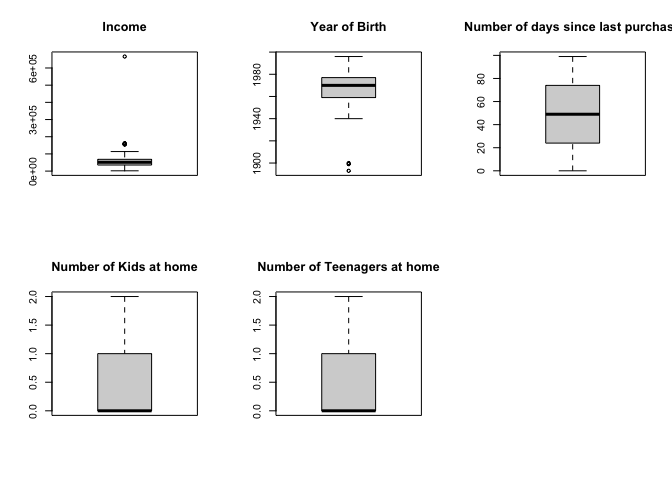
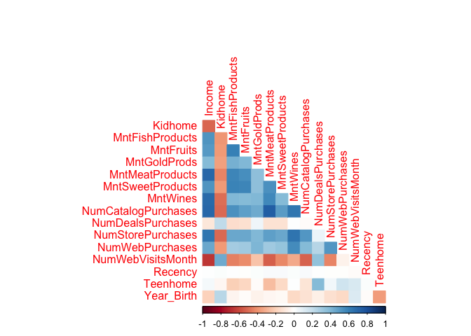

Exploratory Data Analysis
================
Group 4
2023-04-17

## Date Importation and Correction

``` r
df = read.csv("./Datasets/marketing_campaign.csv", header = TRUE, sep = "\t")
glimpse(df)
```

    ## Rows: 2,240
    ## Columns: 29
    ## $ ID                  <int> 5524, 2174, 4141, 6182, 5324, 7446, 965, 6177, 485…
    ## $ Year_Birth          <int> 1957, 1954, 1965, 1984, 1981, 1967, 1971, 1985, 19…
    ## $ Education           <chr> "Graduation", "Graduation", "Graduation", "Graduat…
    ## $ Marital_Status      <chr> "Single", "Single", "Together", "Together", "Marri…
    ## $ Income              <int> 58138, 46344, 71613, 26646, 58293, 62513, 55635, 3…
    ## $ Kidhome             <int> 0, 1, 0, 1, 1, 0, 0, 1, 1, 1, 1, 0, 0, 1, 0, 0, 1,…
    ## $ Teenhome            <int> 0, 1, 0, 0, 0, 1, 1, 0, 0, 1, 0, 0, 0, 1, 0, 0, 1,…
    ## $ Dt_Customer         <chr> "04-09-2012", "08-03-2014", "21-08-2013", "10-02-2…
    ## $ Recency             <int> 58, 38, 26, 26, 94, 16, 34, 32, 19, 68, 11, 59, 82…
    ## $ MntWines            <int> 635, 11, 426, 11, 173, 520, 235, 76, 14, 28, 5, 6,…
    ## $ MntFruits           <int> 88, 1, 49, 4, 43, 42, 65, 10, 0, 0, 5, 16, 61, 2, …
    ## $ MntMeatProducts     <int> 546, 6, 127, 20, 118, 98, 164, 56, 24, 6, 6, 11, 4…
    ## $ MntFishProducts     <int> 172, 2, 111, 10, 46, 0, 50, 3, 3, 1, 0, 11, 225, 3…
    ## $ MntSweetProducts    <int> 88, 1, 21, 3, 27, 42, 49, 1, 3, 1, 2, 1, 112, 5, 1…
    ## $ MntGoldProds        <int> 88, 6, 42, 5, 15, 14, 27, 23, 2, 13, 1, 16, 30, 14…
    ## $ NumDealsPurchases   <int> 3, 2, 1, 2, 5, 2, 4, 2, 1, 1, 1, 1, 1, 3, 1, 1, 3,…
    ## $ NumWebPurchases     <int> 8, 1, 8, 2, 5, 6, 7, 4, 3, 1, 1, 2, 3, 6, 1, 7, 3,…
    ## $ NumCatalogPurchases <int> 10, 1, 2, 0, 3, 4, 3, 0, 0, 0, 0, 0, 4, 1, 0, 6, 0…
    ## $ NumStorePurchases   <int> 4, 2, 10, 4, 6, 10, 7, 4, 2, 0, 2, 3, 8, 5, 3, 12,…
    ## $ NumWebVisitsMonth   <int> 7, 5, 4, 6, 5, 6, 6, 8, 9, 20, 7, 8, 2, 6, 8, 3, 8…
    ## $ AcceptedCmp3        <int> 0, 0, 0, 0, 0, 0, 0, 0, 0, 1, 0, 0, 0, 0, 0, 0, 0,…
    ## $ AcceptedCmp4        <int> 0, 0, 0, 0, 0, 0, 0, 0, 0, 0, 0, 0, 0, 0, 0, 0, 0,…
    ## $ AcceptedCmp5        <int> 0, 0, 0, 0, 0, 0, 0, 0, 0, 0, 0, 0, 0, 0, 0, 1, 0,…
    ## $ AcceptedCmp1        <int> 0, 0, 0, 0, 0, 0, 0, 0, 0, 0, 0, 0, 0, 0, 0, 1, 0,…
    ## $ AcceptedCmp2        <int> 0, 0, 0, 0, 0, 0, 0, 0, 0, 0, 0, 0, 0, 0, 0, 0, 0,…
    ## $ Complain            <int> 0, 0, 0, 0, 0, 0, 0, 0, 0, 0, 0, 0, 0, 0, 0, 0, 0,…
    ## $ Z_CostContact       <int> 3, 3, 3, 3, 3, 3, 3, 3, 3, 3, 3, 3, 3, 3, 3, 3, 3,…
    ## $ Z_Revenue           <int> 11, 11, 11, 11, 11, 11, 11, 11, 11, 11, 11, 11, 11…
    ## $ Response            <int> 1, 0, 0, 0, 0, 0, 0, 0, 1, 0, 0, 0, 0, 0, 0, 1, 0,…

We have 2240 observations and 29 variables.

One of our variables is ID. 3 variables are listed as characters:
Education, Marital_Status, and Dt_Customer The other 25 variables are
numerical variables.

Several data types need to be corrected: Dt_Customer, Education, and
Marital_Status.

``` r
df = df |> mutate(
    Dt_Customer = as.Date(Dt_Customer,"%d-%m-%Y"),
    Education = as.factor(Education),
    Marital_Status = as.factor(Marital_Status))
```

## Sumamry Statistics

``` r
df |> skim_without_charts()
```

|                                                  |      |
|:-------------------------------------------------|:-----|
| Name                                             | df   |
| Number of rows                                   | 2240 |
| Number of columns                                | 29   |
| \_\_\_\_\_\_\_\_\_\_\_\_\_\_\_\_\_\_\_\_\_\_\_   |      |
| Column type frequency:                           |      |
| Date                                             | 1    |
| factor                                           | 2    |
| numeric                                          | 26   |
| \_\_\_\_\_\_\_\_\_\_\_\_\_\_\_\_\_\_\_\_\_\_\_\_ |      |
| Group variables                                  | None |

Data summary

**Variable type: Date**

| skim_variable | n_missing | complete_rate | min        | max        | median     | n_unique |
|:--------------|----------:|--------------:|:-----------|:-----------|:-----------|---------:|
| Dt_Customer   |         0 |             1 | 2012-07-30 | 2014-06-29 | 2013-07-08 |      663 |

**Variable type: factor**

| skim_variable  | n_missing | complete_rate | ordered | n_unique | top_counts                              |
|:---------------|----------:|--------------:|:--------|---------:|:----------------------------------------|
| Education      |         0 |             1 | FALSE   |        5 | Gra: 1127, PhD: 486, Mas: 370, 2n : 203 |
| Marital_Status |         0 |             1 | FALSE   |        8 | Mar: 864, Tog: 580, Sin: 480, Div: 232  |

**Variable type: numeric**

| skim_variable       | n_missing | complete_rate |     mean |       sd |   p0 |      p25 |     p50 |      p75 |   p100 |
|:--------------------|----------:|--------------:|---------:|---------:|-----:|---------:|--------:|---------:|-------:|
| ID                  |         0 |          1.00 |  5592.16 |  3246.66 |    0 |  2828.25 |  5458.5 |  8427.75 |  11191 |
| Year_Birth          |         0 |          1.00 |  1968.81 |    11.98 | 1893 |  1959.00 |  1970.0 |  1977.00 |   1996 |
| Income              |        24 |          0.99 | 52247.25 | 25173.08 | 1730 | 35303.00 | 51381.5 | 68522.00 | 666666 |
| Kidhome             |         0 |          1.00 |     0.44 |     0.54 |    0 |     0.00 |     0.0 |     1.00 |      2 |
| Teenhome            |         0 |          1.00 |     0.51 |     0.54 |    0 |     0.00 |     0.0 |     1.00 |      2 |
| Recency             |         0 |          1.00 |    49.11 |    28.96 |    0 |    24.00 |    49.0 |    74.00 |     99 |
| MntWines            |         0 |          1.00 |   303.94 |   336.60 |    0 |    23.75 |   173.5 |   504.25 |   1493 |
| MntFruits           |         0 |          1.00 |    26.30 |    39.77 |    0 |     1.00 |     8.0 |    33.00 |    199 |
| MntMeatProducts     |         0 |          1.00 |   166.95 |   225.72 |    0 |    16.00 |    67.0 |   232.00 |   1725 |
| MntFishProducts     |         0 |          1.00 |    37.53 |    54.63 |    0 |     3.00 |    12.0 |    50.00 |    259 |
| MntSweetProducts    |         0 |          1.00 |    27.06 |    41.28 |    0 |     1.00 |     8.0 |    33.00 |    263 |
| MntGoldProds        |         0 |          1.00 |    44.02 |    52.17 |    0 |     9.00 |    24.0 |    56.00 |    362 |
| NumDealsPurchases   |         0 |          1.00 |     2.33 |     1.93 |    0 |     1.00 |     2.0 |     3.00 |     15 |
| NumWebPurchases     |         0 |          1.00 |     4.08 |     2.78 |    0 |     2.00 |     4.0 |     6.00 |     27 |
| NumCatalogPurchases |         0 |          1.00 |     2.66 |     2.92 |    0 |     0.00 |     2.0 |     4.00 |     28 |
| NumStorePurchases   |         0 |          1.00 |     5.79 |     3.25 |    0 |     3.00 |     5.0 |     8.00 |     13 |
| NumWebVisitsMonth   |         0 |          1.00 |     5.32 |     2.43 |    0 |     3.00 |     6.0 |     7.00 |     20 |
| AcceptedCmp3        |         0 |          1.00 |     0.07 |     0.26 |    0 |     0.00 |     0.0 |     0.00 |      1 |
| AcceptedCmp4        |         0 |          1.00 |     0.07 |     0.26 |    0 |     0.00 |     0.0 |     0.00 |      1 |
| AcceptedCmp5        |         0 |          1.00 |     0.07 |     0.26 |    0 |     0.00 |     0.0 |     0.00 |      1 |
| AcceptedCmp1        |         0 |          1.00 |     0.06 |     0.25 |    0 |     0.00 |     0.0 |     0.00 |      1 |
| AcceptedCmp2        |         0 |          1.00 |     0.01 |     0.11 |    0 |     0.00 |     0.0 |     0.00 |      1 |
| Complain            |         0 |          1.00 |     0.01 |     0.10 |    0 |     0.00 |     0.0 |     0.00 |      1 |
| Z_CostContact       |         0 |          1.00 |     3.00 |     0.00 |    3 |     3.00 |     3.0 |     3.00 |      3 |
| Z_Revenue           |         0 |          1.00 |    11.00 |     0.00 |   11 |    11.00 |    11.0 |    11.00 |     11 |
| Response            |         0 |          1.00 |     0.15 |     0.36 |    0 |     0.00 |     0.0 |     0.00 |      1 |

This summary has found that our income variable is missing 24 values,
which we will drop; additionally, the mean is larger than the median so
there might be skewing.

``` r
df = df |> drop_na()
```

## Visualization of data

Several of our variables are a simple TRUE/FALSE response, and several
of the variables will be used as response variables. So we only have a
limited number of numerical variables to check for outliers.

``` r
par(mfrow = c(2,3))
boxplot(df$Income,main = "Income")
boxplot(df$Year_Birth,main = "Year of Birth")
boxplot(df$Recency,main = "Number of days since last purchase")
boxplot(df$Kidhome,main = "Number of Kids at home")
boxplot(df$Teenhome,main = "Number of Teenagers at home")
par(mfrow = c(1,1))
```

<!-- -->

Both our Age and Income variables appear to have severe outliers. There
are only four observations that are outliers so they might be errors
from data entry and will be removed.

``` r
df = df |> 
    filter(Income < 600000 & Year_Birth > 1920)
```

For a brief and simple look at how our variables are related, we can
look at the correlation of our numeric variables.

``` r
correlations = df |> 
    select_if(is.numeric) |> 
    select(-c(ID,AcceptedCmp1,AcceptedCmp2, AcceptedCmp3,AcceptedCmp4,AcceptedCmp5,
              Response,Complain,Z_CostContact,Z_Revenue)) |> 
    cor()
corrplot(correlations, method = 'color', order = 'alphabet',type = 'lower', diag = FALSE)
```

<!-- -->

## Calculated fields

For future use in analysis, we will not calculate several variables as
they may be useful later.

``` r
df = df |> 
    group_by(ID) |> 
    mutate(
        total_spent = sum(MntWines,MntFruits,MntMeatProducts,MntFishProducts,
                          MntSweetProducts,MntGoldProds),
        total_response = sum(AcceptedCmp1,AcceptedCmp2,AcceptedCmp3,
                             AcceptedCmp4,AcceptedCmp5,Response),
        CustomerAge = 2021 - Year_Birth,
        TimeASCustomer = (as.Date("2021-01-01") - Dt_Customer)/365,
        )
```

## Export the data

``` r
write.csv(df,"./cleaned.csv")
```
